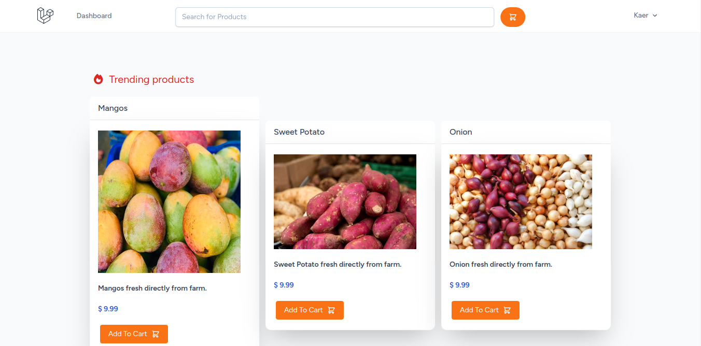
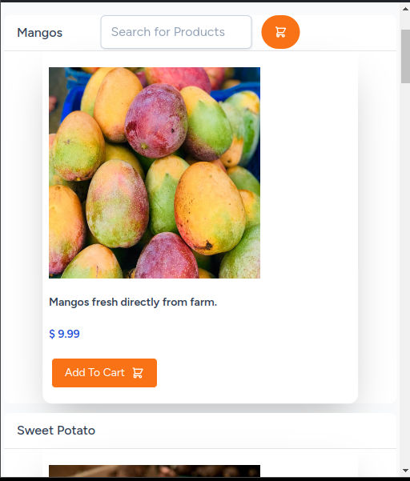
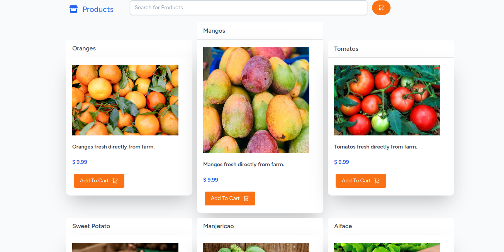

# A Shop who connects directly rural producers with end customers

## Features

- User authentication with Laravel Sanctum
- CRUD operations for managing resources
- Real-time updates with Vue.js and Inertia
- Responsive design with Tailwind CSS
- Caching Trending products
- Shopping Cart

## Requirements

- PHP >= 7.3
- Composer
- Node.js >= 12.x
- NPM or Yarn
- Redis server
- MySQL, PostgreSQL, SQlite

## Installation

1. Clone the repository:
   ```bash
   git clone git@github.com:caiostarke/rural-shop.git

2. Install PHP dependencies:
   ```bash
   composer install

3. Install JavaScript dependencies:
   ```bash
   npm install

4. Create a copy of the .env.example file and rename it to .env. Update the database and other configuration settings in the .env file.

5. Generate application key:
   ```bash
   php artisan key:generate

6. Run database migrations
   ```bash
   php artisan migrate

7. Start the development server:
   ```bash
   php artisan serve
   npm run dev

## Trending Products using Redis



## Normal products list


